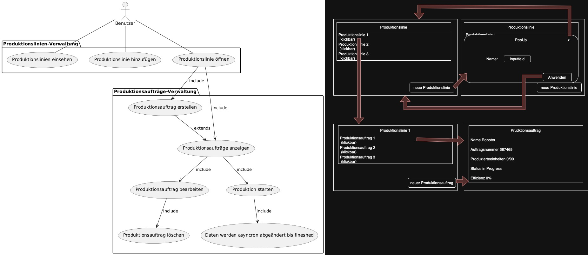

# mes-monitor

## Entwuft 



## Installation Nix-Shell

Um die Entwicklungsumgebung mit Nix bereitzustellen, genügt es, im Projektverzeichnis den Befehl auszuführen:

```sh
nix-shell
```

Alle benötigten Abhängigkeiten werden automatisch bereitgestellt, mithilfe der `shell.nix`-Datei.

## Installation Windows

Für die Entwicklung und Ausführung unter Windows wird [MSYS2](https://www.msys2.org/) benötigt. MSYS2 stellt eine Unix-ähnliche Umgebung sowie einen Paketmanager (`pacman`) bereit, mit dem alle benötigten Abhängigkeiten installiert werden können.

### 🛠️ Entwicklungsumgebung einrichten

1. **MSYS2 installieren:**  
    Lade das Installationsprogramm von [msys2.org](https://www.msys2.org/) herunter und folge der Anleitung.

2. **MSYS2 aktualisieren:**  
    Öffne das MSYS2-Terminal und führe folgende Befehle aus:
    ```sh
    pacman -Syu
    # Terminal ggf. schließen und erneut öffnen, dann:
    pacman -Su
    ```

3. **Benötigte Pakete installieren:**  
    Im `MSYS2 MinGW 64-bit`-Terminal folgende Pakete installieren:
    ```sh
    pacman -S mingw-w64-x86_64-python mingw-w64-x86_64-gtk4 \
      mingw-w64-x86_64-glib2 mingw-w64-x86_64-gobject-introspection \
      mingw-w64-x86_64-graphene mingw-w64-x86_64-pango mingw-w64-x86_64-cairo \
      mingw-w64-x86_64-harfbuzz mingw-w64-x86_64-python-gobject \
      mingw-w64-x86_64-libadwaita mingw-w64-x86_64-ninja \
      mingw-w64-x86_64-meson mingw-w64-x86_64-cmake \
      mingw-w64-x86_64-desktop-file-utils mingw-w64-x86_64-pkgconf \
      mingw-w64-x86_64-gettext-runtime mingw-w64-x86_64-gettext-tools \
      mingw-w64-x86_64-gettext-libtextstyle mingw-w64-x86_64-appstream-glib
    ```

4. **Hinweis:**  
    Stelle sicher, dass du das richtige MinGW-Terminal (`mingw64.exe`) verwendest, damit die Pakete korrekt installiert und gefunden werden.

## Installation auf macOS

### 🛠️ Entwicklungsumgebung einrichten

Die Entwicklungsumgebung kann unter macOS mit den folgenden Homebrew-Paketen bereitgestellt werden:

#### 🔧 Build-System & Compiler-Werkzeuge

Essentiell für Build-Prozesse (z. B. Meson, Ninja, CMake):

- `meson`
- `ninja`
- `pkgconf`
- `libtool`
- `m4`
- `make` (oft implizit durch andere Pakete installiert)
- `gcc` (ggf. zusätzlich erforderlich)
- `llvm`

#### 🎨 GTK & GUI-Toolkits

Für GTK-Anwendungen und GNOME-Software:

- `gtk4`
- `gtksourceview5`
- `gdk-pixbuf`
- `libadwaita`
- `adwaita-icon-theme`
- `hicolor-icon-theme`
- `pango`
- `cairo`
- `fribidi`
- `graphene`
- `graphite2`
- `harfbuzz`
- `libepoxy`
- `gsettings-desktop-schemas`
- `at-spi2-core`
- `libx11`, `libxext`, `libxrender`, `libxi`, `libxfixes`, `libxau`, `libxcb`, `libxdmcp`, `libxtst`
- `xorgproto`
- `desktop-file-utils`

## Troubleshooting

- **Fehlende Icons:**  
    Setze die Umgebungsvariable `XDG_DATA_DIRS` so, dass sie auf den `share/`-Ordner verweist, in dem sich die Icons befinden.  
    Beispiel (macOS):  
    ```sh
    export XDG_DATA_DIRS="/opt/homebrew/Cellar/adwaita-icon-theme/48.0/share:${XDG_DATA_DIRS:-/usr/local/share:/usr/share}"
    ```